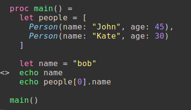

# How to save breakpoints in Nim code from Vim, for command-line GDB debugging

There is an easy-to-use Vim plugin that helps save and load GDB breakpoints to/from disk.
This plugin works great with Nim code as well.

## Prerequisites

1. Clone this repository with Git.
2. Read [the Nim command-line debugging instructions](README.md).
3. Install the [minimal_gdb Vim plugin](https://github.com/mechatroner/minimal_gdb).
For example, I use [vim-plug](https://github.com/junegunn/vim-plug) to install Vim
plugins, so I added:

```
Plug 'mechatroner/minimal_gdb'
```

to my `~/.config/nvim/init.vim` [Neovim](https://neovim.io/) config file and
ran `:PlugInstall`.

4. Find a line of Nim code, and press `<leader>b`, or run `:MinGDBToggleBP` to
toggle a breakpoint. You should see a visual indicator of the breakpoint in the
editor:



5. The breakpoints are saved to disk (see your `~/.gdbinit` for details).
Now you can start debugging from the command-line and use the breakpoint, e.g.:

```
jason@jason-Precision-M4600:~/projects/nim-debug-commandline-example$ ./debug.sh 
GNU gdb (Ubuntu 8.1-0ubuntu3) 8.1.0.20180409-git
Copyright (C) 2018 Free Software Foundation, Inc.
License GPLv3+: GNU GPL version 3 or later <http://gnu.org/licenses/gpl.html>
This is free software: you are free to change and redistribute it.
There is NO WARRANTY, to the extent permitted by law.  Type "show copying"
and "show warranty" for details.
This GDB was configured as "x86_64-linux-gnu".
Type "show configuration" for configuration details.
For bug reporting instructions, please see:
<http://www.gnu.org/software/gdb/bugs/>.
Find the GDB manual and other documentation resources online at:
<http://www.gnu.org/software/gdb/documentation/>.
For help, type "help".
Type "apropos word" to search for commands related to "word"...
No symbol table is loaded.  Use the "file" command.
Breakpoint 1 (/home/jason/projects/nim-debug-commandline-example/main.nim:15) pending.
Reading symbols from bin/main...done.
Loading Nim Runtime support.
(gdb) r
Starting program: /home/jason/projects/nim-debug-commandline-example/bin/main 

Breakpoint 1, main__9bQIWt54CdTNMd7hgR2Bl9cw () at /home/jason/projects/nim-debug-commandline-example/main.nim:15
15	  echo name
(gdb) print name
$1 = "bob"
(gdb)
```

6. The plugin also provides [additional commands](https://github.com/mechatroner/minimal_gdb#commands) that are helpful, e.g.:

- `MinGDBDeleteAll`: Delete all breakpoints
- `MinGDBListAll`: Show all of the breakpoints in a Quickfix buffer
- `MinGDBShowBreakpoints`: Display the breakpoints in a file (useful if you exit the file and want to load breakpoints when reopening)
